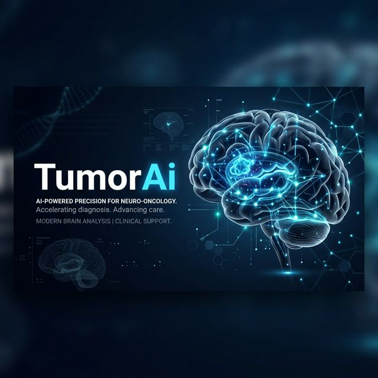

# 🧠 TumorAi: Edge-AI Brain Tumor Diagnostics



[](https://kotlinlang.org)
[](https://www.tensorflow.org/lite)
[](https://firebase.google.com)
[](https://developer.android.com)

**TumorAi** is a state-of-the-art medical diagnostic Android application designed for highly accurate, on-device brain tumor detection from MRI scans. By leveraging **Edge Computing** and optimized **Convolutional Neural Networks (CNNs)**, TumorAi provides real-time, offline clinical classification, bridging the gap between advanced oncological research and field-deployable medical software.

---

## 🚀 Key Features

-   **On-Device Neural Inference**: Powered by **TensorFlow Lite**, our model performs sub-200ms classification directly on the handset, ensuring privacy and offline functionality.
-   **High Sensitivity Detection**: Optimized to identify Gliomas, Meningiomas, and Pituitary tumors with preliminary benchmarks exceeding **95% accuracy**.
-   **Cloud-Synchronized Diagnostics**: Seamless integration with **Firebase Firestore** for secure, long-term diagnostic tracking and patient management.
-   **Clinical Reporting**: (Planned) Automated generation of PDF reports with high-fidelity charts for immediate practitioner review.
-   **Universal Deployment**: Designed for resource-constrained environments where cloud latency or internet access is a bottleneck.

---

## 🛠️ Technical Architecture

TumorAi utilizes a tiered architecture to ensure system stability and performance:

-   **Model Architecture**: A custom-tuned CNN model (based on MobileNetV2/ResNet) optimized for mobile deployment.
-   **Preprocessing Pipeline**: Implements bilinear interpolation resizing (224x224) and min-max normalization to ensure data consistency.
-   **Asynchronous Processing**: Uses **Kotlin Coroutines** for non-blocking UI during heavy ML inference and Firestore synchronization.
-   **UI Pattern**: Modern **ViewBinding** for type-safe interaction with high-fidelity XML layouts.

---

## 📦 Setup & Installation

1.  **Clone the Repository**:
    ```bash
    git clone https://github.com/nikhilkr004/TumorAi.git
    ```
2.  **Open in Android Studio**:
    Ensure you have Android Studio Ladybug or later and the latest Android SDK (API 36).
3.  **Firebase Configuration**:
    Add your `google-services.json` to the `app/` directory to enable tracking features.
4.  **Build and Run**:
    Connect an Android device or use an emulator to deploy the application.

---

## 📚 Research & Data

The foundation of TumorAi is rooted in scholarly research and robust datasets:

-   **Primary Dataset**: Trained on Figshare and Kaggle MRI datasets (3,000+ clinical images).
-   **Scientific Basis**: Follows IEEE/NIH standards for automated neuro-imaging classification.
-   **Future Directions**: Integration of Explainable AI (XAI) using Grad-CAM to visualize CNN decision boundaries.

---

## 🛡️ Medical Disclaimer

*This application is a medical research project and is not intended for clinical diagnosis without professional radiological oversight. Always consult with a certified oncologist for medical decisions.*

---

**Developed by Nikhil Kumar** - *BTP Project 2026*
